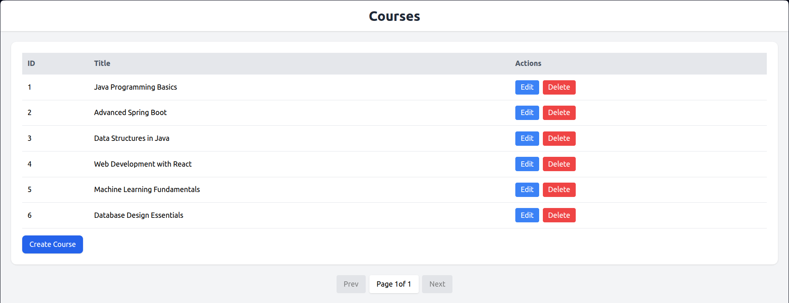
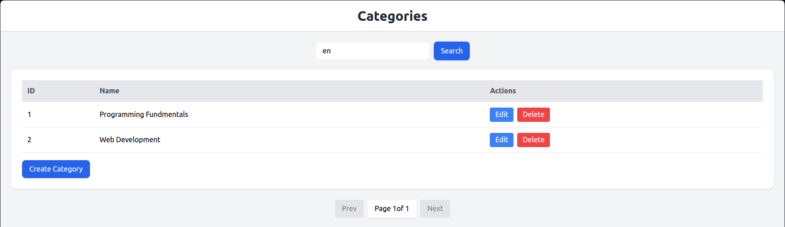
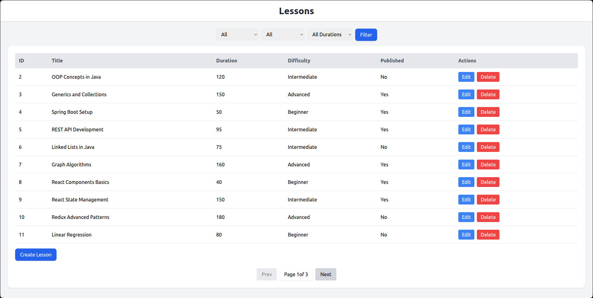
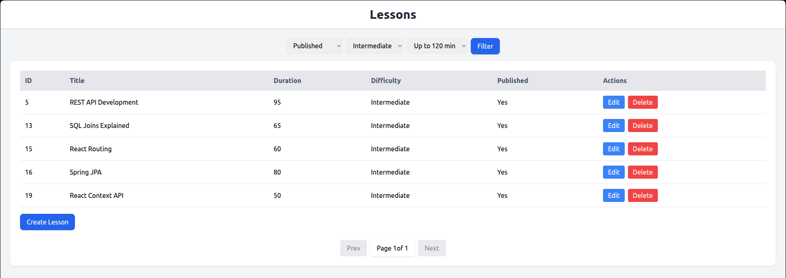
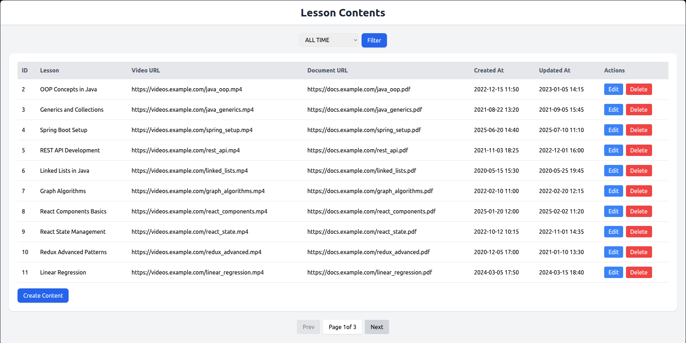
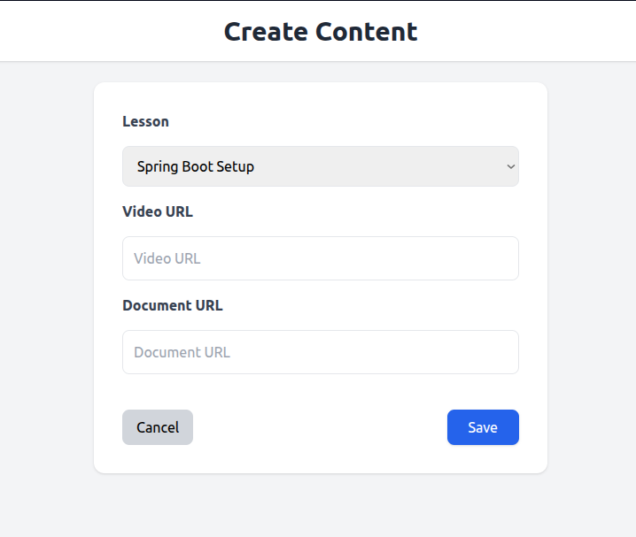
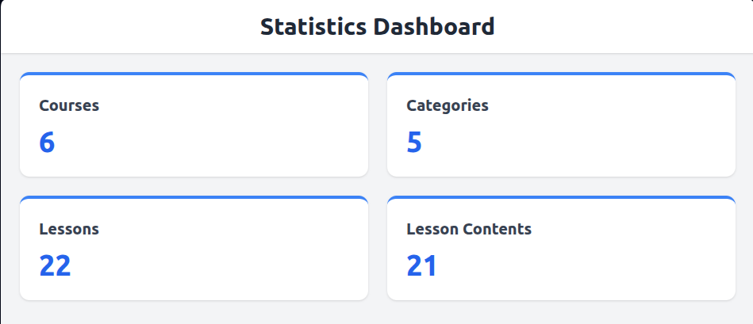

# Course Manager

**Course Manager** is a simple full-stack Spring Boot MVC application for managing courses, lessons, categories, and lesson content. The application features CRUD operations, filtering, pagination, and a basic statistics dashboard with a modern responsive UI built using **Thymeleaf** and **Tailwind CSS**.

---

## Features

- **Manage Your Content**  
  Create, read, update, and delete courses, lessons, categories, and lesson content with ease.

- **Easy Navigation**  
  Filter and paginate through courses and lessons to quickly find what you need.

- **Simple Dashboard**  
  View key statistics like total courses, lessons, categories, and content numbers in a single overview.

- **Reliable Database Handling**  
  Flyway ensures smooth database migrations and initial data seeding.

- **Error Handling**  
  Consistent and centralized exception management for better application stability.

- **Modern UI**  
  Clean and responsive design using **Thymeleaf** templates and **Tailwind CSS**.

---

## Technology Stack

**Backend & Core**
- Java 17
- Spring Boot 4.0.0
- Maven for dependency management

**Persistence**
- Spring Data JPA
- MySQL
- Flyway for database migrations
- HikariCP connection pooling

**Frontend**
- Thymeleaf templates
- Tailwind CSS for styling
- Server-side rendered HTML pages

---

## Screenshots

### Courses Management
Create, view, update, and delete courses.

---

### Categories & Search
Browse and search categories.

---

### Lessons Overview
View all lessons with Pagination and quick actions.

---

### Lesson Filters
Filter lessons by difficulty, duration, and publication status.

---

### Lesson Contents
Manage lesson content associated with lessons.

---

### Create & Edit Forms
Create additional content entries for an existing lesson.

---

### Statistics Dashboard
Overview dashboard summarizing the total number of courses, lessons, categories, and contents.

---
